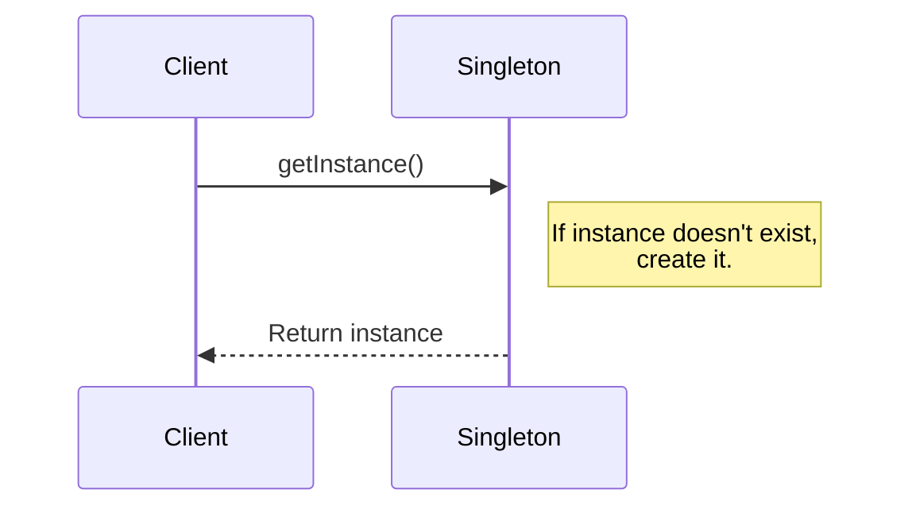
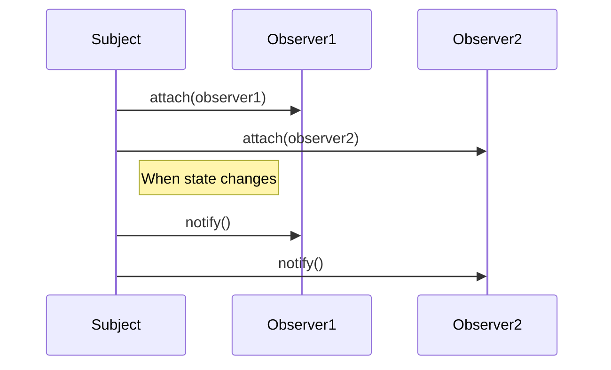
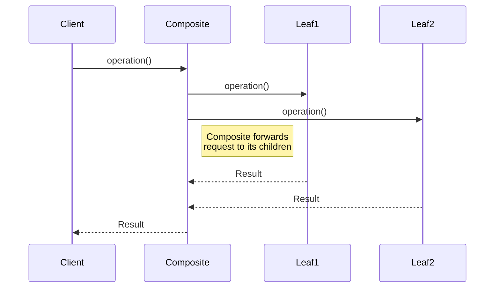

##  Milestone 1 cis_4910 "Research"

### 1. Boost.Asio library (Open Source: [Repository](https://github.com/boostorg/asio))
- **Description:**  
	- Boost.Asio is a cross-platform C++ library for network and low-level I/O programming
- **Important notes:**
	- Supports asynchronous I/O operations
	- Header-Only and Standalone Use
- **Behavioral Pattern:**
	- *Proactor Pattern*
		- The library takes advantage of overlapped I/O to implement the Proactor design pattern, helping in manage long-running operations
		- It is used to handle async I/O operations without using separate threads for each operation. Instead, it uses a demultiplexer to handle multiple asynchronous operations in a single thread.

### 2. Qt library (Open Source: [Repository](https://github.com/qt))

-   **Description:** 
	- Qt is a comprehensive C++ framework for GUI development
-  **Important notes:**
    -   Tool GUI, networking, and database interaction
    -   Supports cross-platform development for major desktop, mobile, and embedded platforms
- **Patterns:**
	- *Wrapper and Adaptor Pattern*
		- encapsulation for lower level capabilities of operating system
	- *Facade Pattern*
		- simple interface to a complex subsystem
	- *Flyweight, Bridge, or Private Implementation Pattern*
		- avoid data copying by passing a pointer to a shared data space for high speed and less memory usage
	- *Observer Pattern*
		- other objects can observe and respond accordingly (like webhooks)
	- *Singleton Pattern*
		- only a single instance
	- *Serializer Pattern*
		- used to read/write other objects
	- *Composite Pattern*
		- a parent object to create many objects

### 3. SFML (Simple and Fast Multimedia Library)  (Open Source: [Repository](https://github.com/SFML/SFML))

-   **Description:** 
	- SFML is a simple, fast, cross-platform and object-oriented multimedia API written in C++. 
-  **Important notes:**
    -   Great for 2D game development, and multimedia applications
    -   Provides low and high-level access to graphics, sound, and input devices
- **Pattern:**
	- *Singleton Pattern*
		- only a single instance
	- *Composite Pattern*
		- a parent object to create many objects
	- *Observer Pattern*
		- other objects can observe and respond accordingly (like webhooks)
	- *Note*: 
		- poor documentation of design patterns implemented
		- had to use article to find out further

###   4. ENet (Open Source: [Repository](https://github.com/lsalzman/enet))
-   **Description:**
    -   Lightweight UDP library
-   **Important Notes:**
    -   Built to be lightweight and reliable for low latency UDP connections
    - Low latency Game connections
- **Pattern:**
	- *Singleton Pattern*
		- only a single instance (managing network-related resources)
	- *Observer Pattern*
		- other objects can observe and respond accordingly (like webhooks)
	- *Note*: 
		- poor documentation of design patterns implemented
		- had to use article to find out further

### 5. RakNet (Open Source: [Repository](https://github.com/facebookarchive/RakNet))

-   **Description:**
    -   RakNet is a C++ game networking engine
-   **Important Notes:**
    -   Includes features like NAT traversal, packet encryption, and bandwidth throttling.
    -   Well-suited for MMORPGs, shooters, and other multiplayer game genres.
- **Pattern:**
	- *Chain of Responsibility Pattern*
		- plugins are attached to an instance of RakPeer or PacketizedTCP and carry the chain of responsibility (kind of like docker chaining)
	- *Singleton Pattern*
		- only a single instance (managing network-related resources)
	- *Observer Pattern*
		- other objects can observe and respond accordingly (like webhooks)

### 6. SLikeNet (Open Source: [Repository](https://github.com/SLikeSoft/SLikeNet))

-   **Description:**
    -   SLikeNet is an open-source cross-platform network engine written in C++. 
    - built on top of RakNet
-   **Important Notes:**
    -   Retains many features of RakNet while adding improvements and bug fixes.
    -   Features include secure connections, voice chat support, and multiplayer functionalities.
- **Pattern:**
	- Inconclusive/unknown

### 7. GameNetworkingSockets (Open Source: [Repository](https://github.com/ValveSoftware/GameNetworkingSockets))

-   **Description:**
    -   GameNetworkingSockets is a networking udp library
-   **Important Notes:**
    -   Developed with an emphasis on Steam's online game requirements.
- **Pattern:**
	- Inconclusive/unknown

### 8. Yojimbo (Open Source: [Repository](https://github.com/mas-bandwidth/yojimbo))

-   **Description:**
    -   Yojimbo is a network library for client/server games written in C++
    -  It specializes in secure, reliable, and easy-to-use networking for multiplayer games.
-   **Important Notes:**
    -   Uses encryption and authentication to secure communications.
    -   Designed for simplicity and ease of integration into game projects.
- **Pattern:**
	- Inconclusive/unknown (probably singleton and observer)

### 9. evpp (Open Source: [Repository](https://github.com/Qihoo360/evpp))

-   **Description:**
    -   evpp is a modern C++ network library for developing high-performance event-driven network applications
-   **Important Notes:**
    -   Optimized for building high-concurrency server applications.
    -   Provides an event-driven model and supports HTTP, TCP, and UDP protocols.
- **Creational Patterns:**
	-   *Singleton* event loop and log system
	-   *Builder:*  used for constructing complex objects, like server and client configurations
    - *Factory*
- **Structural Patterns:**
	-   *Adapter:* allows interfacing with other APIs
	-   *Facade:* simpler explanation to complex subsystem 
	-   *Decorator* 
- **Behavioral Patterns:**
	-   *Callback:* common pattern in asynchronous operations
	-   *State Machine:* manage different states
	- *Observer*

### Common Patterns:
#### Singleton Pattern
*Sequence Diagram Illustration:*

*Pseudocode Illustration:*
```java
class Singleton
    private static instance: Singleton = null
    private constructor()
    public static getInstance()
        if (instance == null)
            instance = new Singleton()
        return instance
int main() {
	singletonInstance = Singleton.getInstance()
}
```
#### Observer Pattern
*Sequence Diagram Illustration:*

*Pseudocode Illustration:*
```java
interface Observer
    method update(subject: Subject)

class ConcreteObserver implements Observer
    method update(subject: Subject)
class Subject
    private observers: list of Observer = []
    method attach(observer: Observer)
        observers.add(observer)
    method detach(observer: Observer)
        observers.remove(observer)
    method notifyObservers()
        for each observer in observers
            observer.update(this)
subject = new Subject()
observer1 = new ConcreteObserver()
observer2 = new ConcreteObserver()
subject.attach(observer1)
subject.attach(observer2)
subject.notifyObservers()
```
#### Composite Pattern
*Sequence Diagram Illustration:*

*Pseudocode Illustration:*
```java
interface Component
    method operation()
class Leaf implements Component
    method operation()
class Composite implements Component
    private children: list of Component = []
    method operation()
        for each child in children
            child.operation()
    method add(component: Component)
        children.add(component)
    method remove(component: Component)
        children.remove(component)
composite = new Composite()
leaf1 = new Leaf()
leaf2 = new Leaf()
composite.add(leaf1)
composite.add(leaf2)
composite.operation()
```


